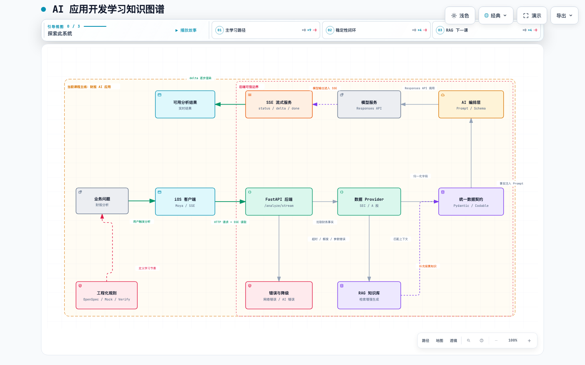

# AI 应用学习笔记

这个仓库用于沉淀 AI 应用开发学习过程中的笔记、流程模型、知识图谱和阶段复盘。

当前学习项目来自：

```text
/Users/leigod/雷神/技术探索/AI-Learning-Labs/MiniAINotes
```

---

## 复习入口

### 配套知识图谱

这张图是用 `archify` 生成的 AI 应用开发流程图，用来先建立整体结构感。



交互版：

- [AI 应用开发学习知识图谱 HTML](knowledge-graphs/ai_application_learning_knowledge_graph.html)
- [Archify 源文件](knowledge-graphs/ai_application_learning_knowledge_graph.architecture.json)

---

建议按这个顺序复习：

```text
先看知识图谱
-> 再读阶段复习笔记
-> 用笔记模型检查每课是否说清楚流程位置
-> 最后回到具体课程和代码
```

入口文件：

- [学习路线](docs/00_学习路线.md)
- [AI 应用开发阶段复习笔记](docs/AI应用开发阶段复习笔记.md)
- [AI 应用开发流程笔记模型](docs/AI应用开发流程笔记模型.md)
- [技能卡片：RAG Chunk 切片](docs/技能卡片_RAG_Chunk切片.md)
- [AI 应用开发学习知识图谱 HTML](knowledge-graphs/ai_application_learning_knowledge_graph.html)

---

## 后续笔记规则

以后每学习一个新技能，都按 `docs/AI应用开发流程笔记模型.md` 落地笔记。

重点不是记录“今天改了什么文件”，而是讲清：

- 这个技能在 AI 应用开发流程中处在哪一环。
- 它的上游输入和下游输出是什么。
- 它解决了什么工程问题。
- 它背后的原理和逻辑流程是什么。
- 它失败时系统应该怎么处理。
- 它在当前项目里的代码、接口和数据模型落在哪里。

---

## 当前内容

```text
docs/
  00_学习路线.md
  AI应用开发阶段复习笔记.md
  AI应用开发流程笔记模型.md
  技能卡片_RAG_Chunk切片.md
  01_第1课_做出SwiftUI界面.md
  ...

knowledge-graphs/
  ai_application_learning_knowledge_graph.html
  ai_application_learning_knowledge_graph.architecture.json
  ai_application_learning_knowledge_graph.visual-check.1440x900.light.png
```
