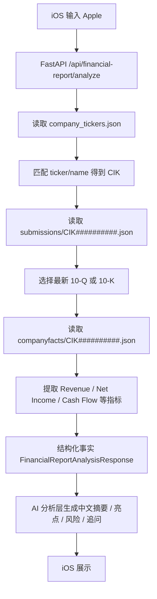

# 第 7 课：接入 SEC EDGAR 真实财报数据

## 这一课做什么

这一课把财报分析从 Mock 数据升级为真实 SEC EDGAR 数据：

```text
公司名称 / 股票代码
-> SEC company_tickers.json
-> CIK
-> submissions 最新 10-K / 10-Q
-> companyfacts XBRL 指标
-> 数据 Provider 生成结构化事实
-> AI 分析层生成中文解读
-> iOS 展示
```

## 先理解几个概念

### CIK

CIK 是 SEC 给每个申报主体分配的唯一编号。比如 Apple 的 CIK 是 `0000320193`。

你可以把它理解为 SEC 世界里的公司主键。公司名可能变，ticker 也可能变，但查询 SEC API 时最终都要落到 CIK。

### 10-K 和 10-Q

`10-K` 是年度报告，信息最完整，通常包含业务、风险、管理层讨论、财务报表等。

`10-Q` 是季度报告，更新更频繁，适合看最新季度变化。

当前应用默认查找最新的 `10-Q` 或 `10-K`，谁更新就先用谁。

### XBRL 和 companyfacts

XBRL 是结构化财报格式。它把财报里的收入、利润、资产、现金流等项目变成机器可读的标签和值。

SEC 的 `companyfacts` API 会把某家公司历史披露过的 XBRL facts 聚合成一个 JSON。它适合我们做第一版指标抽取。

## 为什么 iOS 不直接请求 SEC

SEC 文档说明 `data.sec.gov` 不支持 CORS。虽然 iOS App 不完全等同网页 CORS 场景，但真实产品里仍然推荐由后端统一代理：

- 后端可以设置 SEC 要求的 `User-Agent`
- 后端可以控制请求频率
- 后端可以缓存数据
- 后端可以隐藏模型 API Key
- 后端可以把英文原始数据整理成中文结构

所以 iOS 只调用我们自己的 FastAPI：

```text
POST /api/financial-report/analyze
```

## 本课新增后端文件

```text
backend/app/sec_edgar_service.py
```

这个文件负责数据 Provider 层：

- 查公司列表
- 匹配 company name / ticker
- 找最新 10-K / 10-Q
- 提取 companyfacts 指标
- 组装 `FinancialReportAnalysisResponse`

模型分析层放在：

```text
backend/app/ai_service.py
```

它只接收后端已经整理好的结构化指标，然后生成：

```text
summary
highlights
risks
follow_up_questions
```

它不会改写公司名、ticker、报告期、指标值和免责声明。

## 请求流程



## 当前版本的边界

这一版是“真实数据第一版”，不是完整财报 Agent：

- 只读 SEC JSON，不读完整 HTML 财报原文
- 只抽取常见 US-GAAP 指标
- 不做股价和估值
- 不做买卖建议
- 公司搜索先做保守匹配
- AI 分析层失败时不阻断财报数据展示，只在 highlights 中提示降级
- 当前后端 venv 使用 Python 3.9.6，所以类型标注使用 `Optional[T]` 等兼容写法，而不是只适合更新 Python 的 `T | None`

这些限制是故意保留的。因为学习 AI 应用开发时，第一步应该先把数据链路跑通，再逐步增加 RAG、Tool Calling 和 Agent。

## 阶段成果怎么检验

你可以按这三个层次检查：

### 1. 后端语法检查

```bash
cd backend
env PYTHONPYCACHEPREFIX=.python-cache .venv/bin/python -m py_compile app/config.py app/main.py app/models.py app/ai_service.py app/sec_edgar_service.py
```

### 2. 后端解析逻辑检查

用测试替身模拟 SEC 返回，验证：

- `AAPL` 能匹配到 Apple
- 能找到最新 `10-Q`
- 能从 companyfacts 里提取 Revenue / Net Income 等指标
- 找不到公司时返回中文错误
- 模型分析成功时能覆盖解释性字段
- 模型分析失败时仍返回 Provider 原始结果

### 3. 真机或模拟器联调

启动后端：

```bash
cd backend
.venv/bin/python -m app.server
```

然后在 iOS 里输入：

```text
Apple
AAPL
Microsoft
MSFT
Nvidia
NVDA
```

如果网络正常，结果区应该展示真实 SEC 元数据和部分真实 XBRL 指标。

本次已验证 `AAPL` 真实链路：

```text
Apple Inc.
AAPL 10-Q 报告期截至 2026-06-27 2026-07-31
Revenue $313.7B
Gross Profit $146.9B
Operating Income $100.6B
Net Income $84.5B
Operating Cash Flow $81.8B
Assets $359.2B
```

## 你应该重点观察什么

这一课不是让你背 SEC API，而是建立真实 AI 应用的工程直觉：

- 用户输入通常不能直接拿来用，要先映射成系统 ID。
- 真实数据源通常不是一个接口解决全部问题。
- 财务指标不是自然语言，而是结构化事实。
- AI 分析应该建立在事实之上，而不是直接让模型编。
- 模型分析层应该可降级，不能因为模型失败就让用户完全看不到数据。
- 前端契约稳定很重要，后端从 Mock 换真实数据时，iOS 最好不用大改。
