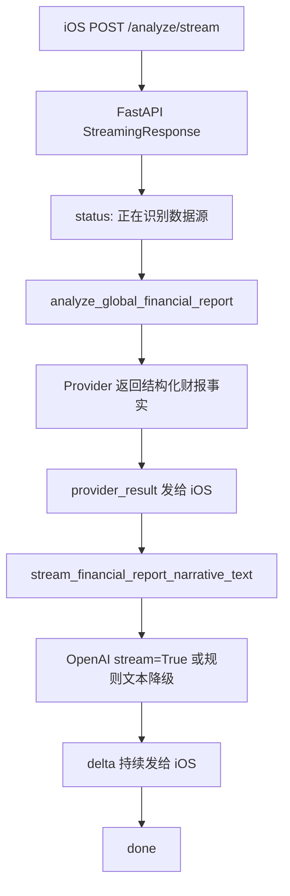

# 第 9 课：财报分析流式输出

## 这一课做什么

这一课把财报分析从“一次性等完整结果”升级为“边分析边显示”。

核心流程是：

```text
iOS 输入公司名
-> 后端先调用 analyze_global_financial_report
-> Provider 识别市场并获取结构化财报事实
-> 后端把结构化事实发给 iOS
-> 后端再把结构化事实交给 AI 生成中文解读
-> AI 每生成一段，后端就用 SSE 推给 iOS
-> iOS 持续追加文本
```

注意这里的关键点：不是让 AI 自己去网上找财报，而是后端先把数据拿稳，再让 AI 解释数据。

## 为什么要先 Provider 后 AI

财报应用和普通聊天不同。普通聊天可以直接把用户输入交给模型，但财报分析要先确定事实来源：

```text
公司名 / 股票代码
-> 市场识别
-> SEC / A 股 / 港股等 Provider
-> 结构化事实
-> AI 解读
```

这样做有三个好处：

- 公司、ticker、报告期、披露日期、指标值来自后端 Provider，不靠模型猜。
- AI 只负责解释和组织语言，失败时仍然能展示 Provider 结果。
- iOS 只依赖统一模型，不需要知道 SEC、东方财富、巨潮这些数据源细节。

## 后端 SSE 事件

新增接口：

```text
POST /api/financial-report/analyze/stream
```

它返回 `text/event-stream`，事件顺序大致是：

```text
event: status
data: {"message":"正在识别公司所属市场和数据源"}

event: provider_result
data: {...完整 FinancialReportAnalysisResponse...}

event: delta
data: {"text":"第一段 AI 解读..."}

event: delta
data: {"text":"第二段 AI 解读..."}

event: done
data: {"message":"财报分析结束"}
```

对应后端链路：



## iOS 为什么用 Alamofire

项目网络层规则是 Moya / Alamofire。普通 JSON 请求继续用 Moya 很舒服：

```text
TargetType -> request -> response.data -> Codable
```

但 SSE 不是一次性 JSON，它是持续到来的数据流。这里直接用 Alamofire 的 `streamRequest` 更合适：

```text
Alamofire streamRequest
-> DataStreamRequest
-> streamingData()
-> SSE parser
-> FinancialAnalysisStreamEvent
-> ViewModel state
-> SwiftUI 刷新
```

Moya 仍然保留在原有一次性接口里；流式接口使用底层 Alamofire，是这套网络栈内的自然分工。

## iOS 新增状态

原来只有：

```swift
idle
loading
success
failure
```

现在新增：

```swift
streaming(FinancialAnalysisStreamState)
```

它保存三类信息：

```text
providerResult：后端已经拿到的结构化财报
narrativeText：AI 已经流式生成的中文解读
statusMessage：当前阶段提示
```

页面效果就是：

```text
先显示“正在识别数据源”
-> 收到 provider_result 后显示公司、ticker、指标、亮点、风险
-> 收到 delta 后持续追加 AI 解读
-> done 后合并为最终 success 状态
```

## 流中断时怎么处理

真实 AI 应用里，流式输出的结果是渐进资产。已经收到的内容不能因为后面断流就直接清掉。

所以这一版把客户端状态扩展成：

```text
streaming：还在接收
partial：收到过部分结果，但流中断或没有 done
success：收到 provider_result 并收到 done
failure：还没有任何有效结果就失败
```

核心判断规则：

```text
Provider 还没返回就失败
-> failure

Provider 已返回，AI 生成中断
-> partial，保留财报卡片和已生成文本

连接正常结束但没收到 done
-> partial，因为不能确认后端完整结束

收到 done
-> success
```

这里的 `done` 很重要。它不是一个普通提示，而是客户端判断“这次流式任务完整结束”的确认信号。

## 为什么会出现 -1001 timeout

真机日志里出现过：

```text
NSURLErrorDomain Code=-1001 "The request timed out."
```

这说明 iOS 的 URLSession 认为这条请求太久没有收到新数据。

SSE 不是普通接口。普通接口通常几十秒内返回完整 JSON；SSE 会保持连接。如果后端在某个阶段长时间静默，比如：

```text
正在查东方财富 / SEC / 巨潮
正在等待 AI 返回第一段 delta
```

客户端就可能误以为请求超时。

这次用了两层修复：

```text
后端：长耗时阶段每 10 秒发送 heartbeat comment
iOS：流式请求使用专门的长超时 Alamofire Session
```

heartbeat 是 SSE comment，不是业务事件：

```text
: provider heartbeat

```

iOS parser 会忽略这种 comment，只处理真正带 `event:` / `data:` 的内容。

## 客户端如何打印流错误原因

流式请求失败时，不能只打印：

```text
The request timed out.
```

这句话只能说明“最后失败了”，但不能说明失败发生在请求建立前、服务端响应后、某个 SSE chunk 解码时，还是 URLSession 等待新字节超时。

这一版在 iOS 端补了三层日志：

```text
请求开始：
打印 method、url、timeout、headers、body

流式 completion：
打印 requestURL、HTTP status、mimeType、duration、transactionCount

错误链：
打印 AFError、responseCode、responseContentType、underlying NSError、URLError code、failingURL
```

如果后端发了业务 `error` 事件，ViewModel 还会打印当时的业务进度：

```text
providerReceived：是否已经收到结构化财报
narrativeLength：AI 解读已经收到多少字
fallbackSummaryLength：后端有没有给降级摘要
```

如果本地 catch 到异常，也会打印：

```text
hasPartial：是否可以保留 partial 结果
providerReceived：Provider 结果是否已经到达
narrativeLength：流式文本长度
error：完整底层错误描述
```

这样下次看到 `NSURLErrorDomain Code=-1001` 时，我们能从日志里继续判断：

```text
还没拿到 HTTP status
-> 可能是服务不可达、网络连不上、请求建立阶段超时

已经拿到 HTTP status=200，但 duration 很长后超时
-> 可能是后端某个阶段 heartbeat 没发出来，或 AI 首 token 等待过久

responseCode 不是 2xx
-> 先看后端状态码和错误 body

SSE 事件解码失败
-> 看 event 名和 dataPreview，通常是前后端事件契约不一致
```

这次真实日志里出现过：

```text
Unsupported parameter: 'temperature' is not supported with this model.
```

这不是网络问题，也不是 SSE 问题。日志里同时能看到：

```text
providerReceived=true
status=200
mimeType=text/event-stream
```

说明后端 Provider 已经拿到财报事实，SSE 连接也正常建立并结束；失败点在后端调用 OpenAI Responses API 时传了当前模型不支持的参数。

修复方式是：后端构造模型请求参数时默认不传 `temperature` 这类采样参数。不同模型、不同兼容网关支持的参数不完全一致，学习项目先保守使用最小参数集：

```text
model
instructions
input
max_output_tokens
text.format 或 stream
timeout
```

之后又出现过：

```text
You have no credits remaining.
```

这说明模型请求已经到达 OpenAI，但账号没有可用额度。对财报应用来说，Provider 已经返回了结构化事实，所以不应该让页面直接失败。现在后端遇到 AI 流式层不可用时会自动降级：

```text
provider_result 已发给 iOS
-> OpenAI 流式失败
-> status：提示已切换到规则解读
-> delta：发送规则生成的财报解读文本
-> done：正常结束
```

这样 App 仍然能完整展示财报事实和一段基础解读，只是这段解读不是模型生成，而是后端规则降级生成。

## 一个容易忽略的坑

流式数据不是按“完整中文字符”切分的。网络层可能把一个 UTF-8 中文字符拆成两段。

如果直接这样做：

```swift
每收到一个 Data chunk -> 转 String
```

极端情况下中文可能损坏。

所以这次解析器先按 `Data` 缓冲，等拿到完整 SSE 分隔符后再转字符串：

```text
Data chunk
-> 追加到 buffer
-> 查找 \n\n / \r\n\r\n
-> 拿到完整事件块
-> UTF-8 解码
-> 解析 event/data
-> JSONDecoder
```

这就是为什么新增了“按字节切碎中文事件仍能正确解析”的单测。

## 当前版本的边界

本课先做单向流式展示，不做：

- 取消按钮
- WebSocket
- 多公司并发分析
- 流式结构化 JSON 合并
- RAG 和 Agent

这些之后可以继续加，但第 9 课的主线已经完成：用户能更早看到进度，页面不再像卡住一样等完整结果，并且中途失败时不会丢掉已收到的有效内容。

## 阶段成果怎么检验

### 1. 后端语法检查

```bash
cd backend
env PYTHONPYCACHEPREFIX=.python-cache .venv/bin/python -m py_compile app/config.py app/main.py app/models.py app/ai_service.py app/sec_edgar_service.py app/cninfo_service.py app/global_financial_report_service.py
```

### 2. iOS 构建

```bash
xcodebuild -project ios/MiniAINotes/MiniAINotes.xcodeproj -scheme MiniAINotes -destination 'generic/platform=iOS' build
```

### 3. iOS 单测

此前在 iPhone 17 模拟器上已跑通：

```text
MiniAINotesTests/serverSentEventParserKeepsChineseTextWhenBytesAreSplit
MiniAINotesTests/financialAnalysisStreamDecoderDecodesProviderResult
```

本轮新增了 partial 状态相关测试和客户端流式错误日志，待下次 Xcode 权限可用时重新跑：

```text
MiniAINotesTests/serverSentEventParserIgnoresHeartbeatComments
MiniAINotesTests/financialAnalysisViewModelKeepsPartialResultWhenStreamThrowsAfterProviderResult
MiniAINotesTests/financialAnalysisViewModelTreatsMissingDoneAsPartial
MiniAINotesTests/financialAnalysisViewModelCompletesWhenDoneArrives
MiniAINotesTests/financialAnalysisViewModelFailsWhenStreamThrowsBeforeAnyResult
```

同时原有网络层解析测试和 UI Tests 也通过。

## 你应该重点观察什么

第 9 课真正要建立的是 AI 应用的“分层感”：

- Provider 层负责事实。
- AI 层负责解释。
- SSE 层负责把长耗时过程拆成可见进度。
- ViewModel 负责把事件流折叠成页面状态。
- SwiftUI 只根据状态渲染。
- `done` 负责把“连接结束”升级为“业务完整结束”。
- heartbeat 负责让“后端还在工作”这件事在网络层保持可见。
- 客户端诊断日志要同时看底层错误链和业务进度，否则很容易只看到一个笼统的 timeout。
- 模型 API 参数要按模型能力保守传递；`temperature` 不是所有模型都支持，真实错误要从后端 OpenAI error 里读。
- AI 层没额度或暂不可用时，不要丢掉 Provider 事实；优先用规则文本降级，让用户仍能看到可用结果。

这条链路稳定之后，后面接 RAG、Tool Calling、Agent，都会更顺。
